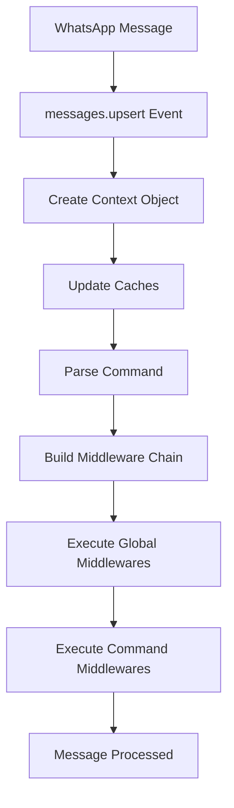

## Overview

WAPI is built on an **event-driven architecture** that leverages WhatsApp's Web API through the Baileys library. The `Bot` class extends Node.js's `EventEmitter`, making it the central hub for handling all WhatsApp events and managing the bot lifecycle.

<CardGroup cols={2}>
  <Card title="Event-Driven" icon="bolt">
    Built on Node.js EventEmitter for reactive, real-time message handling
  </Card>
  <Card title="Middleware Support" icon="layer-group">
    Composable middleware pattern for clean, modular message processing
  </Card>
  <Card title="Session Management" icon="key">
    Flexible authentication strategies: LocalAuth, RedisAuth, MongoAuth
  </Card>
  <Card title="Auto-Reconnection" icon="rotate">
    Intelligent reconnection logic with automatic error recovery
  </Card>
</CardGroup>

## Core Components

The Bot class is defined in `src/core/bot.ts` and contains these essential components:

```typescript
export class Bot extends EventEmitter<IBotEventMap> {
  public uuid: UUID;
  public ws: BotWASocket | null = null;
  public auth: IBotAuth;
  public account: IBotAccount;
  public status: BotStatus = "close";
  public logger: Logger;
  public ping = 0;
  public prefix = "!/";
  private middlewares: MiddlewareFn[] = [];
  private commands = new Map<string, MiddlewareFn[]>();
}
```

### Key Properties

- **uuid**: Unique identifier for the bot instance
- **ws**: The underlying Baileys WebSocket connection
- **auth**: Authentication strategy (LocalAuth, RedisAuth, or MongoAuth)
- **account**: Bot's WhatsApp account information (jid, phone number, name)
- **status**: Current connection status (`close`, `open`, `reconnecting`)
- **prefix**: Command prefix (default: `"!/"`)
- **middlewares**: Global middleware functions
- **commands**: Command-specific middleware map

## Bot Lifecycle

The bot follows a well-defined lifecycle from initialization to message handling:

<Steps>
  <Step title="Create Bot Instance">
    Initialize the bot with a UUID, authentication strategy, and account details:

    ```typescript
import { Bot, LocalAuth } from 'wapi';
import { randomUUID } from 'crypto';

const uuid = randomUUID();
const auth = new LocalAuth(uuid, './sessions');
const bot = new Bot(uuid, auth, { 
  jid: '', 
  pn: '+1234567890', 
  name: 'My Bot' 
});
    ```
  </Step>

  <Step title="Register Event Listeners">
    Set up listeners for bot events before logging in:

    ```typescript
bot.on('qr', (qr) => {
  console.log('QR Code:', qr);
  // Display QR code for scanning
});

bot.on('otp', (otp) => {
  console.log('OTP Code:', otp);
  // Display OTP code for pairing
});

bot.on('open', (account) => {
  console.log('Bot connected:', account);
});

bot.on('close', (reason) => {
  console.log('Bot disconnected:', reason);
});

bot.on('error', (error) => {
  console.error('Bot error:', error);
});
    ```
  </Step>

  <Step title="Set Up Middleware & Commands">
    Register middleware and command handlers:

    ```typescript
// Global middleware
bot.use(async (ctx, next) => {
  console.log(`Message from: ${ctx.from.name}`);
  await next();
});

// Command-specific middleware
bot.command('hello', async (ctx) => {
  await ctx.reply('Hello! 👋');
});
    ```
  </Step>

  <Step title="Login">
    Start the authentication process:

    ```typescript
// Login with QR code
await bot.login('qr');

// OR login with OTP (requires phone number in account)
await bot.login('otp');
    ```
  </Step>

  <Step title="Connection Established">
    Once connected, the bot emits the `'open'` event and starts processing messages.
  </Step>

  <Step title="Message Processing">
    Incoming messages flow through the middleware pipeline and command handlers automatically.
  </Step>
</Steps>

## Event System

The Bot class emits five core events defined in `IBotEventMap`:

### Event: `qr`

Emitted when a QR code is generated for authentication (QR login method).

```typescript
bot.on('qr', (qr: string) => {
  // qr is a string that can be converted to a QR code
  console.log('Scan this QR code:', qr);
});
```

### Event: `otp`

Emitted when an OTP code is generated for authentication (OTP login method).

```typescript
bot.on('otp', (otp: string) => {
  // otp is an 8-character pairing code
  console.log('Enter this code on your phone:', otp);
});
```

### Event: `open`

Emitted when the bot successfully connects to WhatsApp.

```typescript
bot.on('open', (account: IBotAccount) => {
  console.log('Connected as:', account.name);
  console.log('JID:', account.jid);
  console.log('Phone:', account.pn);
});
```

### Event: `close`

Emitted when the bot disconnects from WhatsApp.

```typescript
bot.on('close', (reason: string) => {
  console.log('Disconnected:', reason);
});
```

<Warning>
  The bot implements automatic reconnection for certain error codes (503, 515). For authentication errors (400-405), the session is removed and you must re-authenticate.
</Warning>

### Event: `error`

Emitted when an error occurs during bot operation.

```typescript
bot.on('error', (error: Error) => {
  console.error('Error:', error.message);
});
```

## Connection Management

The bot includes sophisticated connection management logic in the `connection.update` event handler (lines 80-159):

### Status Codes

The bot handles different disconnection scenarios:

| Status Code | Action | Description |
|-------------|--------|-------------|
| 400-405 | Logout & Clean | Authentication errors - session removed |
| 503 | Reconnect (30s delay) | Service unavailable - wait and retry |
| 515 | Reconnect (immediate) | Restart required |
| Other | Reconnect (5s delay) | Unknown error - retry with delay |

### Reconnection Logic

```typescript
// From src/core/bot.ts lines 116-126
case 503: {
  await new Promise((resolve) => (setTimeout(resolve, 30_000)));
  this.status = "reconnecting";
  await this.login(method);
  break;
}
case 515: {
  this.status = "reconnecting";
  await this.login(method);
  break;
}
```

<Tip>
  The bot automatically handles reconnections, but you can monitor the `status` property to track connection state: `close`, `open`, or `reconnecting`.
</Tip>

## Message Flow

When a message is received, here's the complete flow:



### Implementation

From `src/core/bot.ts` lines 160-204:

```typescript
this.ws.ev.on("messages.upsert", async (upsert) => {
  if (upsert.type !== "notify" || !upsert.messages.length) {
    return;
  }
  
  for (const message of upsert.messages) {
    // Create context with parsed command info
    const ctx = new Context(this, message);
    
    // Update group metadata cache if needed
    if (isGroup(ctx.chat.jid) && !groups.has(ctx.chat.jid)) {
      const metadata = await this.groupMetadata(ctx.chat.jid);
      if (metadata) {
        groups.set(ctx.chat.jid, metadata);
      }
    }
    
    // Update contact cache
    if (isLid(ctx.from.jid) && isPn(ctx.from.pn)) {
      contacts.set(ctx.from.jid, { 
        jid: ctx.from.jid, 
        pn: ctx.from.pn, 
        name: ctx.from.name 
      });
    }
    
    // Build middleware chain: global + command-specific
    const middlewares = [
      ...this.middlewares,
      ...(this.commands.get(ctx.commandName) ?? []),
    ];
    
    // Execute middleware pipeline
    if (middlewares.length) {
      let index = -1;
      const runner = async (i: number): Promise<void> => {
        if (i <= index) {
          throw new Error("next() called multiple times.");
        }
        index = i;
        const fn = middlewares[i];
        if (!fn) return;
        
        await fn(ctx, async () => {
          await runner(i + 1);
        });
      };
      await runner(0);
    }
  }
});
```

## Caching System

WAPI maintains in-memory caches for performance optimization:

### Contact Cache

```typescript
import { contacts } from 'wapi';

// Automatically populated when messages are received
const contact = contacts.get('1234567890@lid');
console.log(contact?.name); // User's name
```

### Group Cache

```typescript
import { groups } from 'wapi';

// Automatically populated when group messages are received
const group = groups.get('120363123456789@g.us');
console.log(group?.subject); // Group name
console.log(group?.participants); // Group members
```

<Note>
  The bot automatically manages these caches. Group metadata is fetched when the first message from a group is received, and contact information is updated when messages arrive.
</Note>

## Helper Methods

The Bot class provides utility methods for common operations:

### parseMentions()

Extracts mentions from text (lines 261-276):

```typescript
const text = "Hello @1234567890 and @9876543210";
const mentions = bot.parseMentions(text, 's.whatsapp.net');
// Returns: ['1234567890@s.whatsapp.net', '9876543210@s.whatsapp.net']
```

### parseLinks()

Extracts URLs from text using Autolinker (lines 277-307):

```typescript
const text = "Check out https://example.com and email@example.com";
const links = bot.parseLinks(text);
// Returns: ['https://example.com', 'mailto:email@example.com']
```

### sendMessage()

Send messages programmatically (lines 308-331):

```typescript
const context = await bot.sendMessage('1234567890@s.whatsapp.net', {
  text: 'Hello from WAPI!'
});

console.log('Message sent in', bot.ping, 'ms');
```

### groupMetadata()

Fetch group information (lines 332-343):

```typescript
const metadata = await bot.groupMetadata('120363123456789@g.us');
console.log(metadata?.subject); // Group name
console.log(metadata?.participants.length); // Member count
```

### profilePictureUrl()

Get profile picture URL (lines 344-355):

```typescript
const avatarUrl = await bot.profilePictureUrl('1234567890@s.whatsapp.net');
console.log(avatarUrl); // URL to profile picture
```

## Best Practices

<AccordionGroup>
  <Accordion title="Always handle errors">
    ```typescript
    bot.on('error', (error) => {
      console.error('Bot error:', error);
      // Log to your monitoring service
    });
    ```
  </Accordion>

  <Accordion title="Monitor connection status">
    ```typescript
    bot.on('close', (reason) => {
      console.log('Bot status:', bot.status);
      if (bot.status === 'close') {
        // Connection permanently closed
      }
    });
    ```
  </Accordion>

  <Accordion title="Use proper cleanup">
    ```typescript
    process.on('SIGINT', async () => {
      await bot.disconnect();
      process.exit(0);
    });
    ```
  </Accordion>

  <Accordion title="Leverage caching">
    ```typescript
    // Check cache before fetching
    const group = groups.get(jid) ?? await bot.groupMetadata(jid);
    ```
  </Accordion>
</AccordionGroup>

## Next Steps

<CardGroup cols={2}>
  <Card title="Authentication" icon="key" href="/concepts/authentication">
    Learn about session management strategies
  </Card>
  <Card title="Middleware" icon="layer-group" href="/concepts/middleware">
    Build composable message handlers
  </Card>
  <Card title="Commands" icon="terminal" href="/concepts/commands">
    Create command-based interactions
  </Card>
  <Card title="Context" icon="message" href="/concepts/context">
    Master the Context API
  </Card>
</CardGroup>