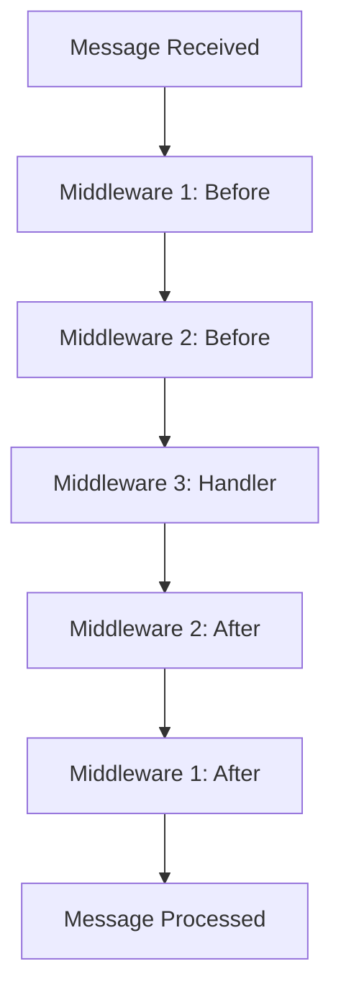

## Overview

WAPI uses a **middleware pattern** inspired by Express.js and Koa.js, allowing you to compose reusable message handlers that execute in sequence. Middleware functions can process messages, modify the context, perform authentication checks, logging, and more.

<CardGroup cols={2}>
  <Card title="Composable" icon="puzzle-piece">
    Chain multiple handlers together for modular code
  </Card>
  <Card title="Order Matters" icon="arrow-down-1-9">
    Middlewares execute in registration order
  </Card>
  <Card title="Flow Control" icon="code-branch">
    Use `next()` to control execution flow
  </Card>
  <Card title="Global & Command" icon="globe">
    Apply middlewares globally or per-command
  </Card>
</CardGroup>

## Middleware Function Signature

From `src/types/bot.ts` lines 28-29:

```typescript
export type NextFn = () => Promise<void>;
export type MiddlewareFn = (ctx: Context, next: NextFn) => Promise<void>;
```

Every middleware function receives:
- **ctx**: The `Context` object containing message data and reply methods
- **next**: Async function to pass control to the next middleware

## Basic Usage

### Global Middleware

Global middlewares run for **every incoming message**:

```typescript
import { Bot, LocalAuth } from 'wapi';
import { randomUUID } from 'crypto';

const bot = new Bot(randomUUID(), new LocalAuth(randomUUID(), './sessions'), {
  jid: '', pn: '', name: ''
});

// This runs for ALL messages
bot.use(async (ctx, next) => {
  console.log(`Message from: ${ctx.from.name}`);
  console.log(`Text: ${ctx.text}`);
  await next(); // Pass to next middleware
});

await bot.login('qr');
```

### Registering Multiple Middlewares

From `src/core/bot.ts` lines 38-40:

```typescript
public use(...middlewares: MiddlewareFn[]): void {
  this.middlewares.push(...middlewares);
}
```

You can register multiple middlewares at once:

```typescript
const logger = async (ctx, next) => {
  console.log('[LOG]', ctx.text);
  await next();
};

const timer = async (ctx, next) => {
  const start = Date.now();
  await next();
  console.log(`Processed in ${Date.now() - start}ms`);
};

const authenticator = async (ctx, next) => {
  if (isAuthorized(ctx.from.jid)) {
    await next();
  } else {
    await ctx.reply('Unauthorized!');
  }
};

// Register all at once
bot.use(logger, timer, authenticator);
```

## The `next()` Function

The `next()` function is crucial for middleware flow control:

### Calling `next()`

```typescript
// ✅ CORRECT: Calls next middleware
bot.use(async (ctx, next) => {
  console.log('Before');
  await next(); // Passes control to next middleware
  console.log('After');
});
```

### Not Calling `next()`

```typescript
// ✅ CORRECT: Stops execution chain
bot.use(async (ctx, next) => {
  if (ctx.text === 'stop') {
    await ctx.reply('Execution stopped');
    // NOT calling next() - chain stops here
    return;
  }
  await next(); // Only called if text !== 'stop'
});
```

### Multiple `next()` Calls

```typescript
// ❌ ERROR: Will throw "next() called multiple times."
bot.use(async (ctx, next) => {
  await next();
  await next(); // ERROR!
});
```

From `src/core/bot.ts` lines 185-187:

```typescript
if (i <= index) {
  throw new Error("next() called multiple times.");
}
```

<Warning>
  Each middleware can only call `next()` once. Multiple calls will throw an error to prevent infinite loops.
</Warning>

## Execution Flow

Middlewares execute in a **stack-like** order:

```typescript
bot.use(async (ctx, next) => {
  console.log('1: Before');
  await next();
  console.log('1: After');
});

bot.use(async (ctx, next) => {
  console.log('2: Before');
  await next();
  console.log('2: After');
});

bot.use(async (ctx, next) => {
  console.log('3: Handler');
  await ctx.reply('Done!');
  // No next() call - end of chain
});

// Output:
// 1: Before
// 2: Before
// 3: Handler
// 2: After
// 1: After
```

### Flow Diagram



## Command-Specific Middleware

From `src/core/bot.ts` lines 41-46:

```typescript
public command(name: string, ...middlewares: MiddlewareFn[]): void {
  if (!name) {
    throw new Error("The command name must be at least 1 character long.");
  }
  this.commands.set(name, middlewares);
}
```

Command middlewares only run when a specific command is detected:

```typescript
bot.command('hello', async (ctx) => {
  await ctx.reply(`Hello, ${ctx.from.name}!`);
});

bot.command('ping', async (ctx) => {
  await ctx.reply('Pong!');
});

// Multiple middlewares for one command
bot.command('admin',
  async (ctx, next) => {
    // Authorization check
    if (ctx.from.jid === 'admin@lid') {
      await next();
    } else {
      await ctx.reply('Admin only!');
    }
  },
  async (ctx) => {
    // Admin handler
    await ctx.reply('Admin command executed');
  }
);
```

## Middleware Composition

From `src/core/bot.ts` lines 178-198, here's how middlewares are composed:

```typescript
// Build middleware chain: global + command-specific
const middlewares = [
  ...this.middlewares,              // Global middlewares first
  ...(this.commands.get(ctx.commandName) ?? []), // Then command middlewares
];

if (middlewares.length) {
  let index = -1;
  const runner = async (i: number): Promise<void> => {
    if (i <= index) {
      throw new Error("next() called multiple times.");
    }
    index = i;
    const fn = middlewares[i];
    if (!fn) {
      return; // End of middleware chain
    }
    await fn(ctx, async () => {
      await runner(i + 1); // Recursively call next middleware
    });
  };
  await runner(0); // Start execution
}
```

### Execution Order

1. **Global middlewares** (in registration order)
2. **Command middlewares** (if command matches)

```typescript
// Global middleware 1
bot.use(async (ctx, next) => {
  console.log('Global 1');
  await next();
});

// Global middleware 2
bot.use(async (ctx, next) => {
  console.log('Global 2');
  await next();
});

// Command middleware
bot.command('test', async (ctx) => {
  console.log('Command handler');
});

// When user sends "!test":
// Output:
// Global 1
// Global 2
// Command handler
```

## Real-World Examples

<Accordion title="Logging Middleware">
  ```typescript
  const logger = async (ctx, next) => {
    const timestamp = new Date().toISOString();
    console.log(`[${timestamp}] ${ctx.from.name}: ${ctx.text}`);
    await next();
  };

  bot.use(logger);
  ```
</Accordion>

<Accordion title="Rate Limiting">
  ```typescript
  const rateLimit = new Map<string, number>();

  const rateLimiter = async (ctx, next) => {
    const now = Date.now();
    const lastMessage = rateLimit.get(ctx.from.jid) || 0;

    if (now - lastMessage < 1000) {
      await ctx.reply('Please wait before sending another message.');
      return; // Stop execution
    }

    rateLimit.set(ctx.from.jid, now);
    await next();
  };

  bot.use(rateLimiter);
  ```
</Accordion>

<Accordion title="Group-Only Filter">
  ```typescript
  const groupOnly = async (ctx, next) => {
    if (ctx.chat.type === 'group') {
      await next();
    } else {
      await ctx.reply('This command only works in groups.');
    }
  };

  bot.command('groupinfo', groupOnly, async (ctx) => {
    await ctx.reply(`Group: ${ctx.chat.name}`);
  });
  ```
</Accordion>

<Accordion title="Error Handling">
  ```typescript
  const errorHandler = async (ctx, next) => {
    try {
      await next();
    } catch (error) {
      console.error('Error processing message:', error);
      await ctx.reply('An error occurred. Please try again.');
    }
  };

  bot.use(errorHandler);
  ```
</Accordion>

<Accordion title="Command Analytics">
  ```typescript
  const analytics = async (ctx, next) => {
    if (ctx.commandName) {
      console.log(`Command used: ${ctx.commandName}`);
      console.log(`Args: ${ctx.args.join(', ')}`);
      console.log(`User: ${ctx.from.name}`);
      // Send to analytics service
    }
    await next();
  };

  bot.use(analytics);
  ```
</Accordion>

<Accordion title="Message Preprocessing">
  ```typescript
  const preprocessor = async (ctx, next) => {
    // Trim whitespace
    ctx.text = ctx.text.trim();

    // Convert to lowercase for case-insensitive commands
    // (commandName is already lowercase, but this helps for text matching)
    const originalText = ctx.text;
    ctx.text = ctx.text.toLowerCase();

    await next();

    // Restore original text after processing
    ctx.text = originalText;
  };

  bot.use(preprocessor);
  ```
</Accordion>

## Advanced Patterns

### Conditional Middleware

```typescript
const conditionalMiddleware = (condition: (ctx: Context) => boolean, ...middlewares: MiddlewareFn[]) => {
  return async (ctx: Context, next: NextFn) => {
    if (condition(ctx)) {
      // Execute middlewares only if condition is true
      let index = -1;
      const runner = async (i: number): Promise<void> => {
        if (i <= index) throw new Error("next() called multiple times.");
        index = i;
        const fn = middlewares[i];
        if (!fn) {
          await next(); // Continue to next global middleware
          return;
        }
        await fn(ctx, async () => await runner(i + 1));
      };
      await runner(0);
    } else {
      await next();
    }
  };
};

// Usage
bot.use(
  conditionalMiddleware(
    (ctx) => ctx.chat.type === 'group',
    async (ctx, next) => {
      console.log('This only runs in groups');
      await next();
    }
  )
);
```

### Middleware Factories

```typescript
function authorize(allowedJids: string[]) {
  return async (ctx: Context, next: NextFn) => {
    if (allowedJids.includes(ctx.from.jid)) {
      await next();
    } else {
      await ctx.reply('You are not authorized to use this command.');
    }
  };
}

// Usage
const adminOnly = authorize(['admin1@lid', 'admin2@lid']);
bot.command('restart', adminOnly, async (ctx) => {
  await ctx.reply('Restarting...');
  process.exit(0);
});
```

### Async Data Loading

```typescript
const loadUserData = async (ctx, next) => {
  // Attach user data to context
  ctx['userData'] = await database.getUserData(ctx.from.jid);
  await next();
};

bot.use(loadUserData);

bot.command('profile', async (ctx) => {
  const userData = ctx['userData'];
  await ctx.reply(`Name: ${userData.name}\nLevel: ${userData.level}`);
});
```

## Best Practices

<Steps>
  <Step title="Always await next()">
    ```typescript
    // ✅ CORRECT
    await next();

    // ❌ WRONG - Missing await
    next();
    ```
  </Step>

  <Step title="Place error handlers first">
    ```typescript
    bot.use(errorHandler); // First
    bot.use(logger);       // Then other middlewares
    bot.use(rateLimiter);
    ```
  </Step>

  <Step title="Keep middlewares focused">
    Each middleware should have a single responsibility (logging, auth, etc.).
  </Step>

  <Step title="Use early returns">
    ```typescript
    bot.use(async (ctx, next) => {
      if (!isValid(ctx)) {
        await ctx.reply('Invalid message');
        return; // Stop here
      }
      await next();
    });
    ```
  </Step>

  <Step title="Don't modify ctx.message">
    The original `ctx.message` object should not be modified. Use separate properties instead.
  </Step>
</Steps>

## Common Pitfalls

<Warning>
  **Forgetting to call `next()`**
  
  If you forget to call `next()`, subsequent middlewares won't execute:
  
  ```typescript
  // ❌ BAD - next() never called
  bot.use(async (ctx, next) => {
    console.log('This runs');
    // Forgot await next();
  });

  bot.use(async (ctx, next) => {
    console.log('This NEVER runs');
  });
  ```
</Warning>

<Warning>
  **Calling `next()` multiple times**
  
  ```typescript
  // ❌ BAD - throws error
  bot.use(async (ctx, next) => {
    await next();
    await next(); // Error!
  });
  ```
</Warning>

<Warning>
  **Not handling errors in async code**
  
  ```typescript
  // ❌ BAD - uncaught promise rejection
  bot.use(async (ctx, next) => {
    const data = await fetchData(); // May throw
    await next();
  });

  // ✅ GOOD - wrapped in try-catch
  bot.use(async (ctx, next) => {
    try {
      const data = await fetchData();
      await next();
    } catch (error) {
      console.error(error);
      await ctx.reply('Failed to fetch data');
    }
  });
  ```
</Warning>

## Debugging Middleware

```typescript
const debugMiddleware = async (ctx, next) => {
  console.log('--- Middleware Debug ---');
  console.log('From:', ctx.from.name);
  console.log('Text:', ctx.text);
  console.log('Command:', ctx.commandName);
  console.log('Args:', ctx.args);
  console.log('Chat Type:', ctx.chat.type);
  console.log('------------------------');
  await next();
};

bot.use(debugMiddleware);
```

## Next Steps

<CardGroup cols={2}>
  <Card title="Commands" icon="terminal" href="/concepts/commands">
    Learn about the command system
  </Card>
  <Card title="Context" icon="message" href="/concepts/context">
    Master the Context API
  </Card>
</CardGroup>