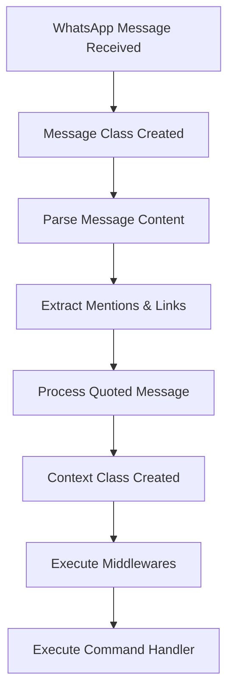

## Understanding the Message Class

Every incoming message in WAPI is represented by the `Message` class, which provides a structured way to access message content, sender information, and chat details.

<Note>
The `Message` class is automatically instantiated when your bot receives a message. In middleware functions, you'll work with the `Context` class, which extends `Message` with additional functionality.
</Note>

## Message Properties

The `Message` class exposes several key properties for working with incoming messages:

<CardGroup cols={2}>
  <Card title="Message Content" icon="message">
    Access the text content, media type, and metadata
  </Card>
  <Card title="Sender Info" icon="user">
    Get information about who sent the message
  </Card>
  <Card title="Chat Details" icon="comments">
    Determine if it's a private chat or group
  </Card>
  <Card title="Rich Data" icon="link">
    Parse mentions, links, and quoted messages
  </Card>
</CardGroup>

### Basic Message Information

```typescript
bot.use(async (ctx, next) => {
  // Message ID and timestamp
  console.log(ctx.id);        // Message ID
  console.log(ctx.timestamp); // Unix timestamp
  
  // Message content
  console.log(ctx.text);      // Text content
  console.log(ctx.type);      // Message type (e.g., "conversation", "imageMessage")
  console.log(ctx.size);      // Content size in bytes or characters
  
  await next();
});
```

### Sender Information

The `from` property contains details about the message sender:

```typescript
bot.use(async (ctx, next) => {
  // Sender details
  console.log(ctx.from.jid);  // WhatsApp LID (lid format)
  console.log(ctx.from.pn);   // Phone number (s.whatsapp.net format)
  console.log(ctx.from.name); // Display name
  
  // Check if message is from the bot itself
  const isFromMe = ctx.from.jid === ctx.bot.account.jid;
  
  await next();
});
```

### Chat Information

The `chat` property tells you where the message was sent:

```typescript
bot.use(async (ctx, next) => {
  // Chat identification
  console.log(ctx.chat.jid);   // Chat identifier
  console.log(ctx.chat.type);  // "private" or "group"
  console.log(ctx.chat.name);  // Chat display name
  
  // Addressing mode
  console.log(ctx.chat.addressing); // "pn" or "lid"
  
  // Check chat type
  if (ctx.chat.type === "private") {
    console.log("This is a private chat");
    console.log(ctx.chat.pn); // Phone number (only in private chats)
  } else if (ctx.chat.type === "group") {
    console.log("This is a group chat");
  }
  
  await next();
});
```

## Message Types

WAPI supports various WhatsApp message types. You can detect the type using the `type` property:

<Tabs>
  <Tab title="Text Messages">
    ```typescript
    bot.use(async (ctx, next) => {
      if (ctx.type === "conversation" || ctx.type === "extendedTextMessage") {
        console.log("Text message:", ctx.text);
      }
      await next();
    });
    ```
  </Tab>
  <Tab title="Media Messages">
    ```typescript
    bot.use(async (ctx, next) => {
      // Image messages
      if (ctx.type === "imageMessage") {
        console.log("Image received");
        console.log("Mimetype:", ctx.mimetype);
        console.log("Caption:", ctx.text);
        console.log("File hash:", ctx.hash);
      }
      
      // Video messages
      if (ctx.type === "videoMessage") {
        console.log("Video received");
        console.log("Size:", ctx.size, "bytes");
      }
      
      // Audio messages
      if (ctx.type === "audioMessage") {
        console.log("Audio received");
      }
      
      // Document messages
      if (ctx.type === "documentMessage") {
        console.log("Document received");
        console.log("Mimetype:", ctx.mimetype);
      }
      
      await next();
    });
    ```
  </Tab>
  <Tab title="Special Messages">
    ```typescript
    bot.use(async (ctx, next) => {
      // Sticker messages
      if (ctx.type === "stickerMessage") {
        console.log("Sticker received");
      }
      
      // View once messages (disappearing media)
      if (ctx.type === "viewOnceMessage" || 
          ctx.type === "viewOnceMessageV2") {
        console.log("View once message received");
      }
      
      // Location messages
      if (ctx.type === "locationMessage") {
        console.log("Location shared");
      }
      
      await next();
    });
    ```
  </Tab>
</Tabs>

## Parsing Mentions

WAPI automatically parses mentions from message text using the `parseMentions` method. Parsed mentions are available in the `mentions` array:

```typescript
bot.use(async (ctx, next) => {
  if (ctx.mentions.length > 0) {
    console.log("Message mentions:", ctx.mentions);
    
    // Mentions are in JID format: "1234567890@s.whatsapp.net" or "1234567890@lid"
    ctx.mentions.forEach(jid => {
      console.log("Mentioned user:", jid);
    });
    
    // Reply mentioning the same users
    await ctx.reply("Thanks for the mention!", {
      mentions: ctx.mentions
    });
  }
  
  await next();
});
```

<Tip>
The `parseMentions` method (from `bot.ts:261-275`) uses a regex pattern to extract mentions in the format `@1234567890` and converts them to proper WhatsApp JID format based on the addressing mode.
</Tip>

### Manual Mention Parsing

You can also manually parse mentions from text:

```typescript
bot.use(async (ctx, next) => {
  const text = "Hello @1234567890 and @9876543210!";
  
  // Parse mentions for standard WhatsApp format
  const mentions = ctx.bot.parseMentions(text, "s.whatsapp.net");
  // Returns: ["1234567890@s.whatsapp.net", "9876543210@s.whatsapp.net"]
  
  // Parse mentions for LID format (new addressing)
  const lidMentions = ctx.bot.parseMentions(text, "lid");
  // Returns: ["1234567890@lid", "9876543210@lid"]
  
  await next();
});
```

## Parsing Links

WAPI automatically extracts links from messages using the `parseLinks` method:

```typescript
bot.use(async (ctx, next) => {
  if (ctx.links.length > 0) {
    console.log("Message contains links:", ctx.links);
    
    ctx.links.forEach(link => {
      console.log("Found link:", link);
      
      // Check if it's a specific domain
      if (link.includes("github.com")) {
        console.log("GitHub link detected!");
      }
    });
  }
  
  await next();
});
```

<Note>
The `parseLinks` method (from `bot.ts:277-306`) uses the Autolinker library to detect URLs, email addresses, and phone numbers in text. It supports both explicit URLs with schemes and TLD-based matching.
</Note>

### Link Detection Features

The link parser detects:
- URLs with schemes (http://, https://)
- Domain names with TLDs (example.com)
- Email addresses (user@example.com)
- Phone numbers
- External ad reply links from message context

```typescript
bot.command("links", async (ctx) => {
  if (ctx.links.length === 0) {
    await ctx.reply("No links found in your message.");
    return;
  }
  
  const linkList = ctx.links
    .map((link, index) => `${index + 1}. ${link}`)
    .join("\n");
  
  await ctx.reply(`Found ${ctx.links.length} link(s):\n${linkList}`);
});
```

## Handling Quoted Messages

When a user replies to a message, you can access the quoted message:

```typescript
bot.use(async (ctx, next) => {
  if (ctx.quoted) {
    console.log("This message quotes another message");
    console.log("Quoted text:", ctx.quoted.text);
    console.log("Quoted type:", ctx.quoted.type);
    console.log("Quoted sender:", ctx.quoted.from.name);
    
    // Reply to the quoted message
    await ctx.reply(`You quoted: "${ctx.quoted.text}"`);
  }
  
  await next();
});
```

<Warning>
The `quoted` property is automatically parsed from the message's context info (see `message.ts:142-154`). Nested quotes are removed to prevent infinite recursion.
</Warning>

## Practical Examples

<Steps>
  <Step title="Echo Bot">
    Create a bot that repeats what users say:
    
    ```typescript
    bot.command("echo", async (ctx) => {
      const text = ctx.args.join(" ");
      if (!text) {
        await ctx.reply("Please provide text to echo.");
        return;
      }
      await ctx.reply(text);
    });
    ```
  </Step>
  
  <Step title="Message Info Command">
    Display detailed information about the current message:
    
    ```typescript
    bot.command("info", async (ctx) => {
      const info = [
        `*Message Information*`,
        `ID: ${ctx.id}`,
        `Type: ${ctx.type}`,
        `From: ${ctx.from.name} (${ctx.from.pn})`,
        `Chat: ${ctx.chat.name} (${ctx.chat.type})`,
        `Size: ${ctx.size} bytes`,
        `Mentions: ${ctx.mentions.length}`,
        `Links: ${ctx.links.length}`,
        `Has quote: ${ctx.quoted ? 'Yes' : 'No'}`
      ].join("\n");
      
      await ctx.reply(info);
    });
    ```
  </Step>
  
  <Step title="Link Extractor">
    Extract and validate all links from messages:
    
    ```typescript
    bot.use(async (ctx, next) => {
      if (ctx.links.length > 0) {
        console.log(`[${ctx.chat.name}] ${ctx.from.name} shared ${ctx.links.length} link(s)`);
        
        // Filter for specific domains
        const githubLinks = ctx.links.filter(link => 
          link.includes("github.com")
        );
        
        if (githubLinks.length > 0) {
          await ctx.reply(`Thanks for sharing GitHub links!`);
        }
      }
      await next();
    });
    ```
  </Step>
  
  <Step title="Mention Notifier">
    Notify when someone mentions specific users:
    
    ```typescript
    const ADMIN_JID = "1234567890@s.whatsapp.net";
    
    bot.use(async (ctx, next) => {
      if (ctx.mentions.includes(ADMIN_JID)) {
        console.log(`Admin was mentioned in ${ctx.chat.name}`);
        // Could send notification or log to database
      }
      await next();
    });
    ```
  </Step>
</Steps>

## Message Flow

Here's how WAPI processes incoming messages:



## Best Practices

<AccordionGroup>
  <Accordion title="Check message types before processing">
    Always verify the message type before attempting to access type-specific properties:
    
    ```typescript
    bot.use(async (ctx, next) => {
      if (ctx.type === "imageMessage") {
        // Safe to access image-specific properties
        console.log(ctx.mimetype);
        console.log(ctx.hash);
      }
      await next();
    });
    ```
  </Accordion>
  
  <Accordion title="Handle empty text gracefully">
    Some message types may have empty text content:
    
    ```typescript
    bot.use(async (ctx, next) => {
      if (ctx.text && ctx.text.trim()) {
        // Process text content
        console.log("Message text:", ctx.text);
      }
      await next();
    });
    ```
  </Accordion>
  
  <Accordion title="Use addressing mode correctly">
    Respect the chat's addressing mode when parsing mentions:
    
    ```typescript
    bot.use(async (ctx, next) => {
      const server = ctx.chat.addressing === "lid" 
        ? "lid" 
        : "s.whatsapp.net";
      
      const mentions = ctx.bot.parseMentions(ctx.text, server);
      await next();
    });
    ```
  </Accordion>
  
  <Accordion title="Log important message events">
    Keep track of critical message types for debugging:
    
    ```typescript
    bot.use(async (ctx, next) => {
      if (ctx.type !== "conversation" && 
          ctx.type !== "extendedTextMessage") {
        console.log(`Special message type: ${ctx.type} from ${ctx.from.name}`);
      }
      await next();
    });
    ```
  </Accordion>
</AccordionGroup>

## Next Steps

<CardGroup cols={2}>
  <Card title="Media Messages" icon="image" href="/guides/media-messages">
    Learn how to send and receive images, videos, and audio
  </Card>
  <Card title="Groups" icon="users" href="/guides/groups">
    Work with group chats and group metadata
  </Card>
  <Card title="Advanced Features" icon="rocket" href="/guides/advanced-features">
    Explore advanced bot patterns and utilities
  </Card>
  <Card title="API Reference" icon="code" href="/api/context">
    Full API documentation for the Context class
  </Card>
</CardGroup>
