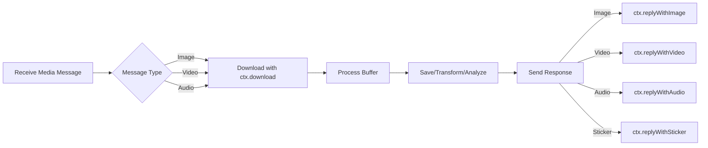

## Overview

WAPI provides simple methods for working with media messages. You can send various media types and download incoming media files using the Context class methods.

<CardGroup cols={2}>
  <Card title="Send Images" icon="image">
    Share photos with captions and options
  </Card>
  <Card title="Send Videos" icon="video">
    Send video files with GIF playback support
  </Card>
  <Card title="Send Audio" icon="music">
    Share voice messages and audio files
  </Card>
  <Card title="Send Stickers" icon="face-smile">
    Send custom WebP stickers
  </Card>
</CardGroup>

## Sending Images

The `replyWithImage()` method allows you to send images from URLs or Buffer objects:

<Tabs>
  <Tab title="From URL">
    ```typescript
    bot.command("photo", async (ctx) => {
      const imageUrl = "https://example.com/photo.jpg";
      
      await ctx.replyWithImage(imageUrl, {
        caption: "Here's your photo!"
      });
    });
    ```
  </Tab>
  <Tab title="From Buffer">
    ```typescript
    import fs from "fs";
    
    bot.command("localphoto", async (ctx) => {
      const imageBuffer = fs.readFileSync("./images/photo.jpg");
      
      await ctx.replyWithImage(imageBuffer, {
        caption: "Photo from local storage"
      });
    });
    ```
  </Tab>
  <Tab title="With Options">
    ```typescript
    bot.command("secretphoto", async (ctx) => {
      const imageUrl = "https://example.com/photo.jpg";
      
      await ctx.replyWithImage(imageUrl, {
        caption: "This photo will disappear!",
        viewOnce: true,  // View once message
        mimetype: "image/jpeg"
      });
    });
    ```
  </Tab>
</Tabs>

<Note>
The `replyWithImage()` method (from `context.ts:41-68`) accepts either a URL string or a Buffer. When using URLs, WhatsApp downloads the image directly. The default mimetype is `image/jpeg`.
</Note>

### Image Options

Available options for `replyWithImage()`:

| Option | Type | Description |
|--------|------|-------------|
| `caption` | `string` | Text caption for the image |
| `mimetype` | `string` | MIME type (default: `image/jpeg`) |
| `viewOnce` | `boolean` | Make it a view-once message |
| `mentions` | `string[]` | JIDs to mention in caption |

## Sending Videos

The `replyWithVideo()` method works similarly to images but supports video files:

<Tabs>
  <Tab title="Video File">
    ```typescript
    bot.command("video", async (ctx) => {
      const videoUrl = "https://example.com/video.mp4";
      
      await ctx.replyWithVideo(videoUrl, {
        caption: "Check out this video!"
      });
    });
    ```
  </Tab>
  <Tab title="GIF Playback">
    ```typescript
    bot.command("gif", async (ctx) => {
      const gifUrl = "https://example.com/animation.mp4";
      
      await ctx.replyWithVideo(gifUrl, {
        caption: "Funny GIF!",
        gifPlayback: true  // Display as GIF in WhatsApp
      });
    });
    ```
  </Tab>
  <Tab title="From Buffer">
    ```typescript
    import fs from "fs";
    
    bot.command("localvideo", async (ctx) => {
      const videoBuffer = fs.readFileSync("./videos/clip.mp4");
      
      await ctx.replyWithVideo(videoBuffer, {
        caption: "Local video file",
        mimetype: "video/mp4"
      });
    });
    ```
  </Tab>
</Tabs>

<Tip>
Use the `gifPlayback: true` option to make videos play as GIFs in WhatsApp without sound and with automatic looping.
</Tip>

### Video Options

Available options for `replyWithVideo()`:

| Option | Type | Description |
|--------|------|-------------|
| `caption` | `string` | Text caption for the video |
| `mimetype` | `string` | MIME type (default: `video/mp4`) |
| `viewOnce` | `boolean` | Make it a view-once message |
| `gifPlayback` | `boolean` | Display as GIF (no sound, loops) |
| `mentions` | `string[]` | JIDs to mention in caption |

## Sending Audio

The `replyWithAudio()` method sends audio files and voice messages:

<Tabs>
  <Tab title="Audio File">
    ```typescript
    bot.command("audio", async (ctx) => {
      const audioUrl = "https://example.com/song.mp3";
      
      await ctx.replyWithAudio(audioUrl);
    });
    ```
  </Tab>
  <Tab title="Voice Message">
    ```typescript
    import fs from "fs";
    
    bot.command("voice", async (ctx) => {
      const audioBuffer = fs.readFileSync("./audio/voice.mp3");
      
      await ctx.replyWithAudio(audioBuffer, {
        mimetype: "audio/mpeg"
      });
    });
    ```
  </Tab>
</Tabs>

<Note>
The `replyWithAudio()` method (from `context.ts:99-126`) defaults to `audio/mpeg` mimetype. For voice messages, WhatsApp automatically detects the audio waveform.
</Note>

### Audio Options

Available options for `replyWithAudio()`:

| Option | Type | Description |
|--------|------|-------------|
| `mimetype` | `string` | MIME type (default: `audio/mpeg`) |
| `viewOnce` | `boolean` | Make it a view-once message |
| `mentions` | `string[]` | JIDs to mention |

## Sending Stickers

The `replyWithSticker()` method sends WebP stickers:

```typescript
import fs from "fs";

bot.command("sticker", async (ctx) => {
  // Stickers must be in WebP format as a Buffer
  const stickerBuffer = fs.readFileSync("./stickers/cool.webp");
  
  await ctx.replyWithSticker(stickerBuffer);
});
```

<Warning>
The `replyWithSticker()` method (from `context.ts:128-146`) only accepts Buffer objects, not URLs. Stickers must be in WebP format (`image/webp` mimetype).
</Warning>

### Creating Stickers from Images

You can convert images to stickers using image processing libraries:

```typescript
import sharp from "sharp";

bot.command("makesticker", async (ctx) => {
  // Check if message has an image
  if (ctx.type !== "imageMessage") {
    await ctx.reply("Please send an image with this command.");
    return;
  }
  
  try {
    // Download the image
    const imageBuffer = await ctx.download();
    
    // Convert to WebP sticker format (512x512)
    const stickerBuffer = await sharp(imageBuffer)
      .resize(512, 512, {
        fit: "contain",
        background: { r: 0, g: 0, b: 0, alpha: 0 }
      })
      .webp()
      .toBuffer();
    
    // Send as sticker
    await ctx.replyWithSticker(stickerBuffer);
  } catch (error) {
    await ctx.reply("Failed to create sticker.");
  }
});
```

## Downloading Media

The `download()` method retrieves media content from incoming messages:

```typescript
bot.use(async (ctx, next) => {
  // Check if message contains media
  const mediaTypes = [
    "imageMessage",
    "videoMessage",
    "audioMessage",
    "documentMessage",
    "stickerMessage"
  ];
  
  if (mediaTypes.includes(ctx.type)) {
    console.log(`Received ${ctx.type}`);
    console.log(`Size: ${ctx.size} bytes`);
    console.log(`Mimetype: ${ctx.mimetype}`);
    
    // Download the media
    const buffer = await ctx.download();
    console.log(`Downloaded ${buffer.length} bytes`);
    
    // Process the buffer (save to file, upload to storage, etc.)
  }
  
  await next();
});
```

<Note>
The `download()` method (from `context.ts:174-176`) uses Baileys' `downloadMediaMessage` function to retrieve media content as a Buffer.
</Note>

## Practical Examples

<Steps>
  <Step title="Image Mirror Bot">
    Download an image and send it back:
    
    ```typescript
    bot.command("mirror", async (ctx) => {
      if (ctx.type !== "imageMessage") {
        await ctx.reply("Please send an image with this command.");
        return;
      }
      
      // Download the image
      const imageBuffer = await ctx.download();
      
      // Send it back
      await ctx.replyWithImage(imageBuffer, {
        caption: "Here's your image back!"
      });
    });
    ```
  </Step>
  
  <Step title="Media Information Bot">
    Display details about received media:
    
    ```typescript
    bot.command("mediainfo", async (ctx) => {
      const mediaTypes = ["imageMessage", "videoMessage", "audioMessage"];
      
      if (!mediaTypes.includes(ctx.type)) {
        await ctx.reply("Please send media with this command.");
        return;
      }
      
      const info = [
        `*Media Information*`,
        `Type: ${ctx.type.replace("Message", "")}`,
        `Size: ${(ctx.size / 1024).toFixed(2)} KB`,
        `Mimetype: ${ctx.mimetype}`,
        `Hash: ${ctx.hash}`,
        ctx.text ? `Caption: ${ctx.text}` : "No caption"
      ].join("\n");
      
      await ctx.reply(info);
    });
    ```
  </Step>
  
  <Step title="Auto-Save Media">
    Automatically save received media to disk:
    
    ```typescript
    import fs from "fs";
    import path from "path";
    
    bot.use(async (ctx, next) => {
      const mediaTypes = ["imageMessage", "videoMessage", "audioMessage"];
      
      if (mediaTypes.includes(ctx.type)) {
        try {
          const buffer = await ctx.download();
          
          // Create filename from hash and mimetype
          const ext = ctx.mimetype.split("/")[1];
          const filename = `${ctx.hash}.${ext}`;
          const filepath = path.join("./downloads", filename);
          
          // Save to disk
          fs.writeFileSync(filepath, buffer);
          console.log(`Saved media to ${filepath}`);
        } catch (error) {
          console.error("Failed to save media:", error);
        }
      }
      
      await next();
    });
    ```
  </Step>
  
  <Step title="Gallery Command">
    Send multiple images in sequence:
    
    ```typescript
    bot.command("gallery", async (ctx) => {
      const images = [
        "https://example.com/photo1.jpg",
        "https://example.com/photo2.jpg",
        "https://example.com/photo3.jpg"
      ];
      
      await ctx.reply("Sending gallery...");
      
      for (let i = 0; i < images.length; i++) {
        await ctx.replyWithImage(images[i], {
          caption: `Photo ${i + 1} of ${images.length}`
        });
      }
    });
    ```
  </Step>
</Steps>

## Media Type Detection

You can create a utility to check media types:

```typescript
function isMediaMessage(type: string): boolean {
  const mediaTypes = [
    "imageMessage",
    "videoMessage",
    "audioMessage",
    "documentMessage",
    "stickerMessage"
  ];
  return mediaTypes.includes(type);
}

bot.use(async (ctx, next) => {
  if (isMediaMessage(ctx.type)) {
    console.log("Media message received");
  }
  await next();
});
```

## Media Flow Diagram



## Best Practices

<AccordionGroup>
  <Accordion title="Handle download errors gracefully">
    Always wrap `download()` calls in try-catch blocks:
    
    ```typescript
    bot.command("download", async (ctx) => {
      try {
        const buffer = await ctx.download();
        console.log(`Downloaded ${buffer.length} bytes`);
      } catch (error) {
        await ctx.reply("Failed to download media.");
        console.error(error);
      }
    });
    ```
  </Accordion>
  
  <Accordion title="Validate media size">
    Check media size before processing:
    
    ```typescript
    bot.use(async (ctx, next) => {
      if (ctx.type === "imageMessage") {
        const maxSize = 10 * 1024 * 1024; // 10 MB
        
        if (ctx.size > maxSize) {
          await ctx.reply("Image is too large (max 10 MB).");
          return;
        }
        
        const buffer = await ctx.download();
        // Process image...
      }
      await next();
    });
    ```
  </Accordion>
  
  <Accordion title="Use appropriate mimetypes">
    Specify correct mimetypes for better compatibility:
    
    ```typescript
    // Images
    await ctx.replyWithImage(buffer, { mimetype: "image/jpeg" });
    await ctx.replyWithImage(buffer, { mimetype: "image/png" });
    
    // Videos
    await ctx.replyWithVideo(buffer, { mimetype: "video/mp4" });
    
    // Audio
    await ctx.replyWithAudio(buffer, { mimetype: "audio/mpeg" });
    await ctx.replyWithAudio(buffer, { mimetype: "audio/ogg; codecs=opus" });
    ```
  </Accordion>
  
  <Accordion title="Clean up temporary files">
    Remove temporary media files after processing:
    
    ```typescript
    import fs from "fs";
    import os from "os";
    import path from "path";
    
    bot.command("process", async (ctx) => {
      if (ctx.type !== "imageMessage") return;
      
      const buffer = await ctx.download();
      const tempFile = path.join(os.tmpdir(), `${ctx.id}.jpg`);
      
      try {
        fs.writeFileSync(tempFile, buffer);
        // Process the file...
      } finally {
        // Clean up
        if (fs.existsSync(tempFile)) {
          fs.unlinkSync(tempFile);
        }
      }
    });
    ```
  </Accordion>
  
  <Accordion title="Optimize media before sending">
    Compress images and videos to reduce bandwidth:
    
    ```typescript
    import sharp from "sharp";
    
    bot.command("optimized", async (ctx) => {
      const originalUrl = "https://example.com/large-image.jpg";
      
      // Download and optimize
      const response = await fetch(originalUrl);
      const buffer = Buffer.from(await response.arrayBuffer());
      
      const optimized = await sharp(buffer)
        .resize(1920, 1080, { fit: "inside" })
        .jpeg({ quality: 80 })
        .toBuffer();
      
      await ctx.replyWithImage(optimized, {
        caption: "Optimized image"
      });
    });
    ```
  </Accordion>
</AccordionGroup>

## Error Handling

Common errors and how to handle them:

```typescript
bot.use(async (ctx, next) => {
  if (ctx.type === "imageMessage") {
    try {
      const buffer = await ctx.download();
      
      // Process the image
      await processImage(buffer);
      
      await ctx.reply("Image processed successfully!");
    } catch (error) {
      if (error.message.includes("connection")) {
        await ctx.reply("Network error. Please try again.");
      } else if (error.message.includes("size")) {
        await ctx.reply("File is too large.");
      } else {
        await ctx.reply("Failed to process image.");
      }
      
      console.error("Media error:", error);
    }
  }
  
  await next();
});
```

## Next Steps

<CardGroup cols={2}>
  <Card title="Groups" icon="users" href="/guides/groups">
    Work with group chats and manage group media
  </Card>
  <Card title="Advanced Features" icon="rocket" href="/guides/advanced-features">
    Explore advanced bot patterns and utilities
  </Card>
  <Card title="Handling Messages" icon="message" href="/guides/handling-messages">
    Learn about message types and parsing
  </Card>
  <Card title="API Reference" icon="code" href="/api/context">
    Full API documentation for Context methods
  </Card>
</CardGroup>
